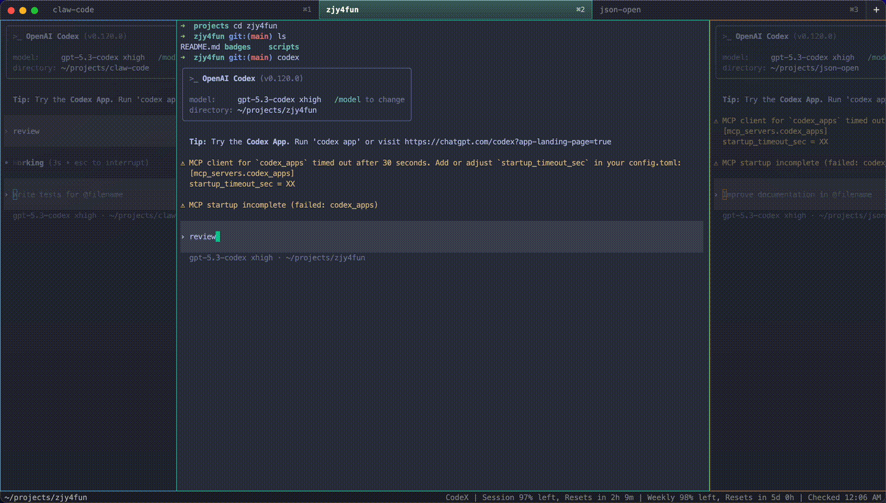

# FlowDeck

<p align="center">
  
</p>

Focus-first desktop terminal workspace for agentic coding, built with Electron, TypeScript, xterm.js, and `node-pty`.

[中文文档](./README.zh-CN.md)

## Demo



## Overview

FlowDeck is a desktop terminal workspace designed for focused, pane-based coding sessions. It combines a compact Electron shell with PTY-backed terminals so the UI stays lightweight while still running real shell sessions.

## Platform Support

FlowDeck currently targets macOS and Windows.

- Local development and runtime validation are primarily done on macOS.
- CI build and type-check validation run on macOS and Windows runners.
- Release artifacts include macOS `.dmg` and `.zip`, plus Windows `.exe`.
- Linux is not supported at this time.

## Brand

Brand assets live in [`assets/brand/`](./assets/brand/). The icon features three side-by-side terminal panes with distinct color accents (orange, teal, purple), representing multiple concurrent terminal sessions within a single workspace.

## Highlights

- Real PTY-backed terminals powered by `node-pty`
- Multi-pane workspace with add, close, focus, and drag-reorder interactions
- Inline tab renaming with terminal title fallback
- Keyboard navigation mode with `Ctrl+B`
- Better default visual separation for the first three sessions (blue, green, orange accents)
- Renderer settings for font size, pane width, pane opacity, and theme
- Minimal status bar that stays focused on the active working directory
- Built-in update window with download progress, cancel, and restart actions
- Capture mode that writes a static snapshot to `/tmp/flowdeck-prototype.png`
- macOS/Windows/Linux packaging via `electron-builder`

## Tech Stack

- Electron
- TypeScript
- esbuild
- xterm.js
- node-pty

## Project Structure

- `src/main/` Electron main process, PTY lifecycle, and persisted settings
- `src/preload/` safe preload bridge exposed to the renderer
- `src/renderer/` application shell, pane and tab behavior, state, and styles
- `scripts/build.mjs` build entrypoint for the TypeScript and esbuild bundle
- `dist/` generated build output

## Getting Started

### Prerequisites

- Node.js 22+
- pnpm 10+

### Install

```bash
pnpm install
```

### Run the app

```bash
pnpm start
```

### Build only

```bash
pnpm build
```

### Capture a static render

```bash
FLOWDECK_CAPTURE=1 pnpm start
```

The capture is written to `/tmp/flowdeck-prototype.png`.

## Packaging

### Create an unpacked app bundle

```bash
pnpm pack
```

### Build distributable packages

```bash
pnpm dist
```

The current release workflow packages macOS and Windows artifacts.
Linux artifacts are not produced.

## Versioning and Releases

FlowDeck uses `bumpp` to manage version bumps and release tags. Release notes are maintained in [CHANGELOG.md](./CHANGELOG.md).

### Release process

1. Update `CHANGELOG.md` with the new version's changes
2. Run the release command:

```bash
pnpm release
```

This does the following:

1. updates the project version
2. creates a git commit
3. creates a `v*` git tag
4. pushes the commit and tag to GitHub

After the tag reaches GitHub, the release workflow automatically:

- builds macOS and Windows packages
- uploads `.dmg`, `.zip`, `.exe`, `.yml`, and `app.asar` artifacts
- creates a GitHub Release with the description from `CHANGELOG.md`

### Bump version only (dry run)

```bash
pnpm release:dry
```

## macOS Install Notes

If you install FlowDeck from a local DMG and macOS blocks the app, that is usually caused by Gatekeeper, missing notarization, or local permission prompts.

### "FlowDeck is damaged" or "can't be opened"

If the app was downloaded from the internet and macOS quarantined it, remove the quarantine attribute and try again:

```bash
xattr -dr com.apple.quarantine /Applications/FlowDeck.app
```

You can also right-click the app in Finder, choose `Open`, and confirm the dialog once.

### "Developer cannot be verified"

This means the build is not signed or notarized with an Apple Developer identity. For local testing, use one of these options:

1. Open `System Settings` -> `Privacy & Security`
2. Find the blocked app message near the bottom
3. Click `Open Anyway`

Or launch once from Terminal:

```bash
open /Applications/FlowDeck.app
```

### Terminal / shell access issues

FlowDeck uses `node-pty` to start real shell sessions. If terminals fail to launch or cannot access protected folders, check:

- `System Settings` -> `Privacy & Security` -> `Files and Folders`
- `System Settings` -> `Privacy & Security` -> `Full Disk Access` if you need access to protected directories

After changing permissions, fully quit and reopen FlowDeck.

### GUI app startup from terminal fails (Electron SIGABRT / abort trap)

If GUI apps launched inside FlowDeck's terminal fail immediately (for example Electron projects crashing at startup with `SIGABRT` on macOS), the host session is likely sandboxed/restricted.

To match iTerm behavior, start FlowDeck itself from a normal desktop session (Finder, Launchpad, Terminal, or iTerm), not from a sandboxed runtime/CI wrapper.

### For distributable releases

To avoid these warnings for end users, the macOS build should eventually be:

- code signed with a valid Apple Developer ID
- notarized by Apple
- stapled before distribution

## Verification

Minimum verification:

```bash
pnpm build
pnpm exec tsc --noEmit
```

For UI or terminal behavior changes, also run:

```bash
pnpm start
```

## License

MIT. See [LICENSE](./LICENSE).
